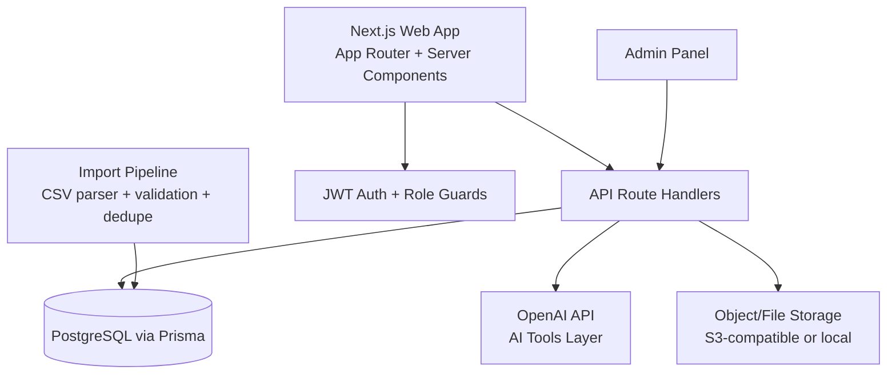

# High School PrepPath

Production-ready full-stack web platform for discovering, evaluating, and applying to selective high schools.

## 1) System Architecture



### Scalability and security choices
- Server-side rendering and route handlers for cache-friendly responses.
- Indexed PostgreSQL schema for fast filtering/search across 500+ schools and thousands of users.
- JWT-based auth and role-aware access (`STUDENT`, `PARENT`, `ADMIN`).
- AI orchestration isolated in `/api/ai/*` endpoints.
- File uploads abstracted via storage adapter.

## 2) Folder Structure

```txt
high-school-preppath/
  prisma/schema.prisma
  scripts/import-schools.ts
  src/
    app/
      page.tsx
      schools/page.tsx
      schools/[id]/page.tsx
      dashboard/page.tsx
      ai-tools/page.tsx
      about/page.tsx
      contact/page.tsx
      admin/page.tsx
      api/
        import-schools/route.ts
        schools/route.ts
        auth/{register,login}/route.ts
        dashboard/route.ts
        documents/upload/route.ts
        ai/*/route.ts
        admin/enrich-schools/route.ts
    components/SchoolCard.tsx
    lib/{db,auth,ai,storage}.ts
```

## 3) Database Schema

Implemented in `prisma/schema.prisma` with required tables:
- `schools`
- `profiles`
- `saved_schools`
- `matcher_results`
- `interview_sessions`
- `essays`
- `ssat_practice`
- `checklist_tasks`
- `documents`
- `user_roles`

All models include:
- Primary key (`id`)
- Timestamps (`createdAt`, `updatedAt`)
- Foreign keys where needed
- Query indexes for performance (`state`, `competitiveness`, `userId`, due dates, etc.)

## 4) API Endpoints

### Core
- `POST /api/import-schools` upload CSV and ingest schools.
- `GET /api/schools` school search endpoint.
- `GET /api/dashboard?userId=...` aggregated dashboard data.
- `POST /api/documents/upload` secure document upload + metadata persistence.

### Auth
- `POST /api/auth/register`
- `POST /api/auth/login`

### AI Tools
- `POST /api/ai/matcher`
- `POST /api/ai/generator`
- `POST /api/ai/interview-coach`
- `POST /api/ai/improve-chances`
- `POST /api/ai/ssat`
- `POST /api/ai/application-assistant`

### Admin
- `POST /api/admin/enrich-schools`

## Design System
- Primary: `#1D3557`
- Accent: `#2A9D8F`
- Background: `#F8F9FA`
- Card: `#FFFFFF`
- Heading font: `Poppins`
- Body font: `Inter`

## Data ingestion workflow
1. Parse `schools_full.csv`.
2. Validate required columns (`name`, `city`, `state`).
3. Dedupe by NCES ID or generated slug.
4. Insert validated schools.
5. Support future upload through API or CLI script.

## Deployment
1. Create PostgreSQL database.
2. Set `.env` from `.env.example`.
3. Run:
   - `npm install`
   - `npx prisma migrate dev`
   - `npm run dev`
4. Deploy on Vercel/Render/Fly with managed Postgres + object storage.

## Performance
- Database indexes for search filters.
- Response payload limits on list endpoints.
- Server-side data fetching.
- AI calls isolated and async per tool endpoint.
